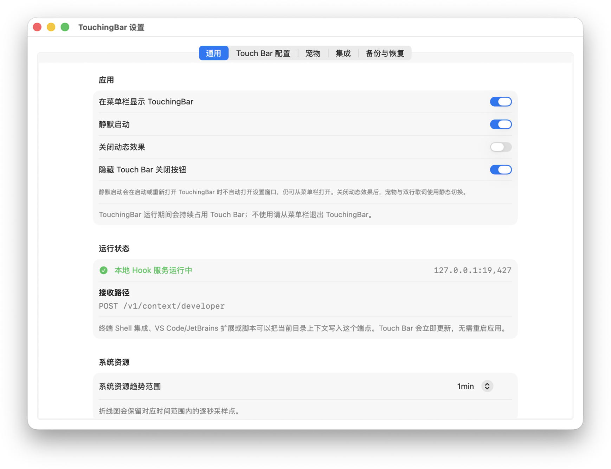
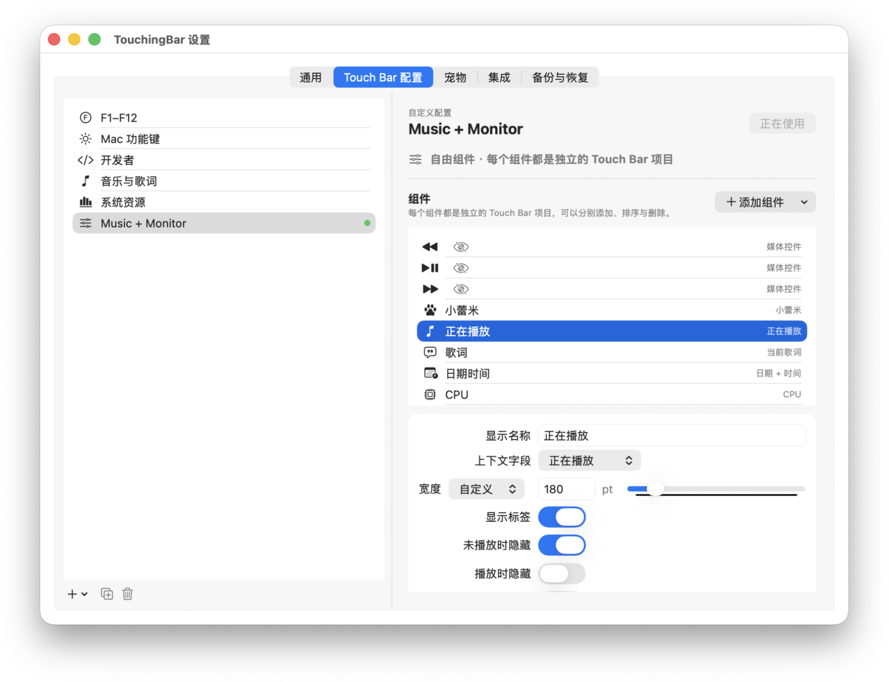
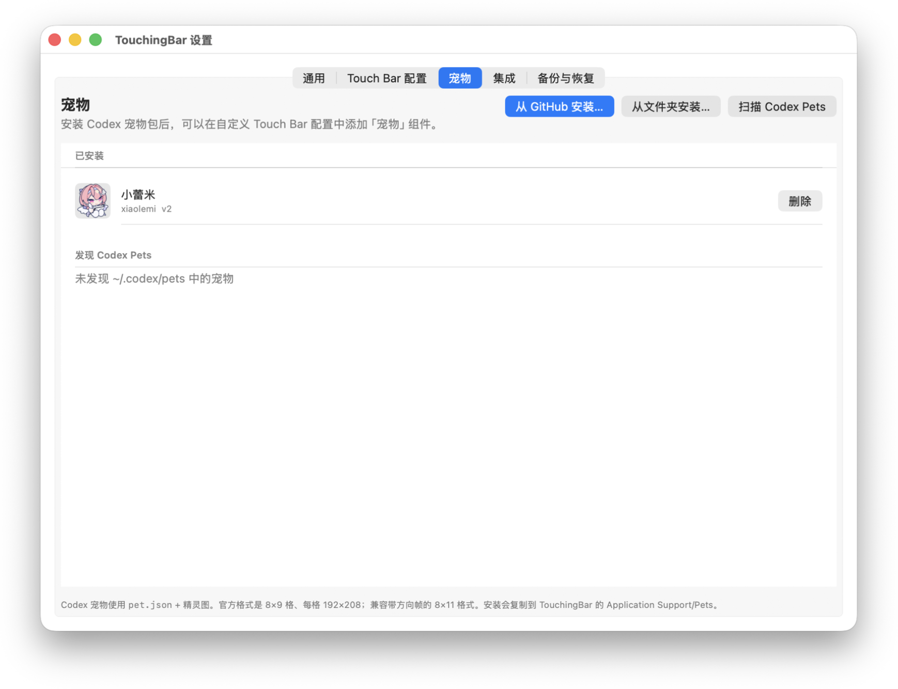

# TouchingBar

TouchingBar 是一个能够自定义你的 Touchbar 的小工具，让你的 Touchbar 变成你的玩具而不是一个用户体验感受较差的产品

希望你喜欢这个小玩具，PR is welcomed

> [!warning]
>
> AIGC 声明：本程序存在部分 AIGC 内容，这部分内容由 Deepseek v4.1 Flash 完成

## 预览

### Touchbar 展示

程序提供了部分预设，在这里我作为预览图截图出来，也刚好作为展示吧

### 设置页面

## 功能说明

目前按照我个人的需求做了一些控件，包括基本的 FN 区和快捷功能键，然后就是开发者文件夹的环境信息

媒体这边的话有媒体控制按钮，也有歌曲名称显示、歌词显示，歌词能够显示双语歌词

系统资源的话目前是按照 Tencent Lemon 的标准做了 CPU、GPU、内存、硬盘、温度、上下行网速、风扇转速，然后我自己再额外加了电池的电量、功率和可用时间的显示，如果在充电的话可用时间会变成充满电所需要的时间

当然了，也可以根据自己的需求加各种按钮，而且 Touchbar 本身是可以滑动的，所以加多少都随你

此外，因为小蕾米太可爱了，算是个人的私心吧，加了一个安装 Codex Pets 作为一个宠物常驻在 Touchbar 的功能，只要是符合 Codex Pets 标准的其实都能用

剩下的嘛，欢迎 PR

## 关于我为什么做这个

起因是公司那边换掉台式机，然后只有旧的 Macbook Pro 换，我寻思 Macbook 也比小霸王台式机好，就换了，结果换过来发现有上古科技 Touchbar。这东西我想应该有自定义相关的东西吧，然后搜到了 BetterTouchTool 这个东西，首先它收费，其次是它太复杂了，我没那么多时间去研究，于是就琢磨着让 Deepseek 帮我搓了一下，效果还不错，然后就开源放在这里吧

## Credits

- [BetterTouchTool](https://folivora.ai) 让我知道这个项目的可行性，提供了可行性思路

- [LyricsX](https://github.com/ddddxxx/LyricsX) 和 [lyrimuse](https://github.com/Yudaotor/lyrimuse) 提供了歌词获取的方式以及在 Touchbar 的渲染模式的参考
